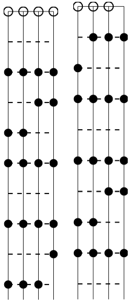
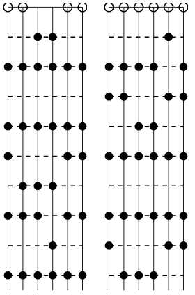

# Xen fret

  
  

Xen fret is a simple web app for generating SVG xenharmonic/microtonal scale diagrams for fretted string instruments. Specifically, for generating scale diagrams for equal temperaments. 

Gettring started
----------------

Xen fret is built with [reflex-frp](https://reflex-frp.org/) and [nix](https://github.com/NixOS/nix), and can be deployed as a static webpage (with front-end  Javascript). An example of this is currently hosted at... 

Example Screenshots
-------------------

The example from above: Major and minor scales for a bass guitar in standard tuning:

Major and minor scales for a bass in 22 tone equal temperament.

Porcupine[7] and Porcupine[8] scales for a bass guitar in 22 tone equal temperament:

Mavila[9] scale diagram for a guitar in 16 tone equal temperament:

Major and minor scales on a mandolin:

Major and minor scales on a guitar:

