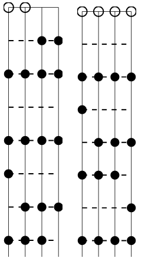
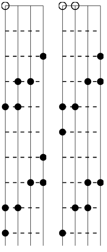
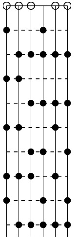

# hsfret
Hsfret is a CGI interface for generating SVG microtonal scale diagrams for fretted string instruments. Specifically, for generating scale diagrams for equal temperaments. I eventually would like to turn this into a nice web-interface as well, but until then, here is how to use the CGI interface:

The CGI arguments are:

**period**: The number of steps in the scale to the octave, (or other interval of equivalence, such as the tritave -- the software makes no distinction there).

**frets**: The number of frets displayed for each scale chart generated -- an integer. 

**scales**: The scales generated are represented as a list of integers representing intervals (with 0 -- the unison, being implicit), and multiple scales can be requested, so this argument is a list of lists of positive integers, for example, with a period of 12, the following would generate the scale charts of the major and minor diatonic modes: `[[2,2,1,2,2,2,1],[2,1,2,2,2,1,2]]`

**tuning**: The tuning of the instrument the scale diagrams will be generated for; this is specified by a list of integers representing the absolute pitch of each note, so (with a period of 12, and assuming E is 0): So for eample, standard bass tuning is: `[0,5,10,15]`, and standard guitar tuning is: `[0,5,10,15,19,24]`. Negative values are illegal absolute pitch values.

**x, y**: x and y describe the scaling of the SVG. Either an x, or a y argument is required, but not both. The program calculates the missing dimension so that none of the image is cut off, as it might be if both were specified manually.

So, a complete usage example looks like: `foo.bar/hsfret.cgi?period=12&frets=7&scales=[[2,2,1,2,2,2,1],[2,1,2,2,2,1,2]]&tuning=[0,5,10,15]&x=100`, which should give two 7-fret scale diagrams for a bass guitar in standard tuning for the major and minor scales.

How do I run it?
----------------

The easiest way to run your own examples (without using a production server with cgi capabilities) is to rename the main executable to something like `hsfret.cgi`, move that to some directory, and then in that directory, run:

    python -m CGIHTTPServer 8000

Then, in your web browser, you should be able to execute `127.0.0.1:8000/hsfrets.cgi?YOUR_ARGUMENTS_HERE`.

Example Screenshots
-------------------

The example from above: Major and minor scales for a bass guitar in standard tuning:

Major and minor scales for a bass in 22 tone equal temperament.

Porcupine[7] and Porcupine[8] scales for a bass guitar in 22 tone equal temperament:

Mavila[9] scale diagram for a guitar in 16 tone equal temperament:

Major and minor scales on a mandolin:

Major and minor scales on a guitar:

